# Accelerating LLM Inference: Exploring Predicted-Outputs in Azure OpenAI

The transformative power of Large Language Models (LLMs) is rooted in their ability to generate coherent, contextually relevant text. However, this capability comes with a significant operational challenge: inference latency. The fundamental architecture of most LLMs is autoregressive, meaning they generate text one token at a time, where each new token depends on all previously generated ones. This inherently sequential process creates a performance bottleneck, particularly for real-time, interactive applications where low latency is critical for user experience. As models grow larger and context windows expand, the time required to generate a complete response can become prohibitively long, limiting the practical deployment of these powerful tools.

To mitigate inference latency, the LLM community has developed several optimization techniques across both model architecture and serving infrastructure. Broadly speaking, these techniques fall into two categories: model-level optimizations and inference-level strategies.

Model-level optimizations include:
	•	Model Distillation: Compressing large models into smaller, faster student models with minimal performance loss. This is widely used in production systems to serve lightweight variants of powerful base models.
	•	Quantization: Reducing the numerical precision of model weights (e.g., from FP32 to INT8), significantly improving memory efficiency and inference throughput.
	•	FlashAttention: An efficient attention mechanism that reduces memory overhead and speeds up computation, particularly effective on modern GPU hardware.
	•	kTransformers / TensorRT-LLM: Frameworks like kTransformers and NVIDIA’s TensorRT-LLM offer highly optimized kernel-level acceleration for transformer architectures, often yielding 2–4× speedups with minimal quality degradation.


Inference-level strategies focus on optimizing the decoding and serving process, and are especially relevant in hosted environments like Azure OpenAI:
	•	Prompt Caching: In Azure OpenAI, prompt caching is automatically enabled for eligible requests. When identical prompt segments are reused (e.g., system prompts or long context history), the service avoids recomputation, thereby reducing end-to-end latency and token cost.
	•	Predicted-Outputs (Speculative Decoding): Recently introduced in Azure OpenAI, this technique enables faster responses by using a smaller model to precompute a batch of candidate tokens. The main model then validates or rejects these candidates in bulk. If the predictions match, the tokens are accepted immediately, reducing token-by-token wait times. This is especially beneficial in chat and agent workflows where early turns are often predictable.

When strategically combined, these techniques can yield 3–10× latency reduction, depending on model size, input length, and deployment stack. Among them, prompt caching and Predicted-Outputs stand out as turnkey features available directly within the Azure OpenAI API, requiring no model retraining or infrastructure changes—making them particularly appealing for enterprise adoption.


## Project Structure
- `1_introduction_to_prompt_cache.md`: Explains prompt caching technology and its benefits.
- `2_introduction_to_predicted_outputs.md`: Explains Azure OpenAI's predicted-outputs feature.
- `3_prompt_cache_vs_predicted_outputs.md`: Compares prompt caching and predicted-outputs.
- `4_combining_optimizations.md`: Discusses how to combine both techniques for maximum efficiency.
- `5_conclusion.md`: Summarizes key points and future directions.
- `references.md`: Lists all references used.
- `code_examples/`: Contains Python scripts demonstrating both techniques.

## 1. Understanding Prompt Caching

### What is Prompt Caching?
Prompt caching is an optimization technique that stores frequently used prompt segments in memory to avoid recomputing them in subsequent requests. When a cached prompt is reused, the model can skip the expensive computation of processing those tokens again, leading to significant latency and cost reductions.

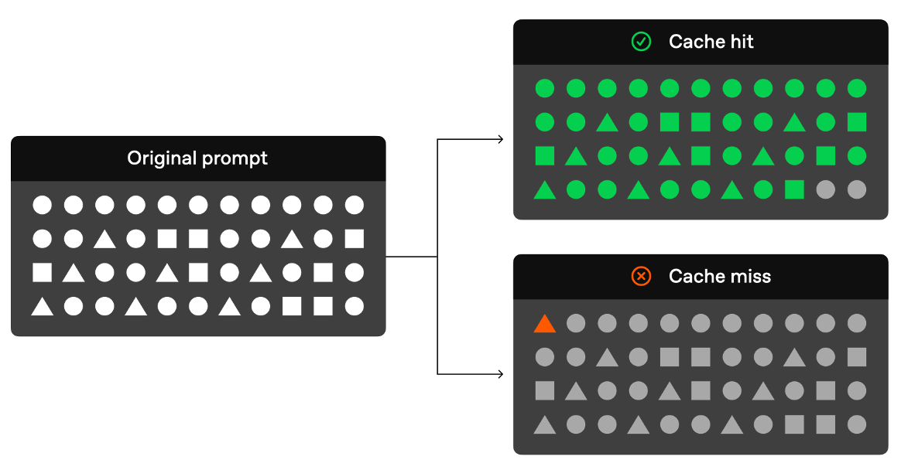

Prompt caching is particularly effective for:
- Conversational AI applications with repeated system prompts
- Code generation with boilerplate code and project context
- Document processing with template structures
- Multi-turn conversations maintaining context


### References
- [Azure OpenAI Prompt Caching Documentation](https://learn.microsoft.com/en-us/azure/ai-services/openai/how-to/prompt-caching)
- [OpenAI Prompt Caching Guide](https://platform.openai.com/docs/guides/prompt-caching)

## 2. Introduction to Predicted-Outputs in Azure OpenAI

### What is Predicted-Outputs?
Azure OpenAI's predicted-outputs feature, introduced in API version `2025-01-01-preview`, reduces latency in chat completions by leveraging pre-known text provided via the `prediction` parameter. This allows the model to focus on generating new or modified content, making it ideal for:
- Regenerating or refining documents (e.g., legal contracts, technical documents).
  
  reference extract relevant passages usecase data:

  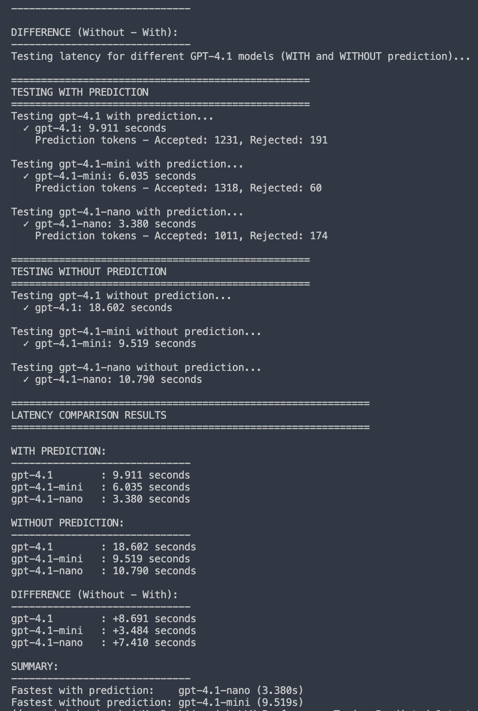

- Auto-completion in IDEs for boilerplate code.
- Completing templates (e.g., personalized emails, reports).
- Dialog turns in chatbots (e.g., customer service).

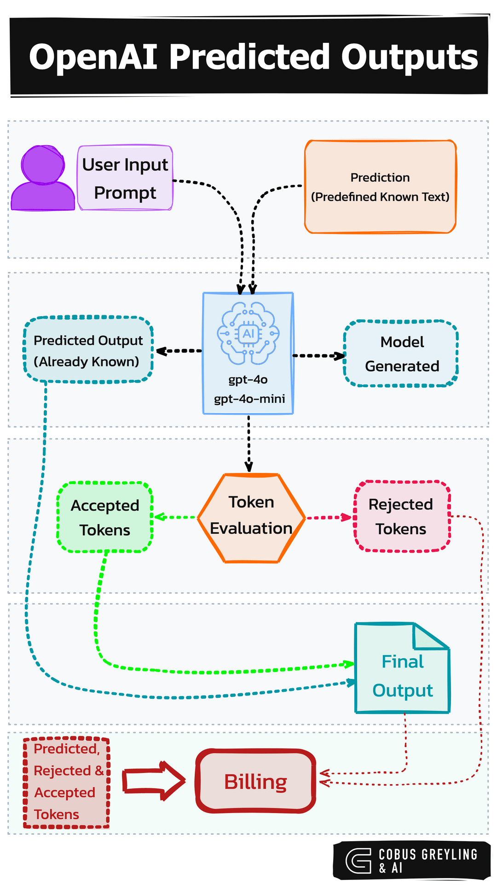

### Supported Models
| Model          | Version       |
|----------------|---------------|
| gpt-4o-mini    | 2024-07-18    |
| gpt-4o         | 2024-08-06    |
| gpt-4o         | 2024-11-20    |
| gpt-4.1        | 2025-04-14    |
| gpt-4.1-nano   | 2025-04-14    |
| gpt-4.1-mini   | 2025-04-14    |

### Benefits
- **Reduced Latency**: Focuses on new/modified sections, speeding up responses.
- **Context Preservation**: Maintains tone, style, and content coherence.

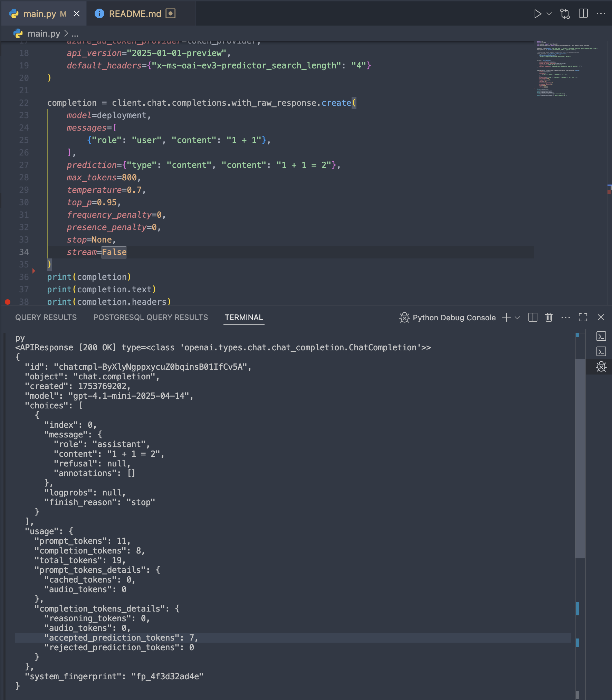

### Limitations
- **Cost**: Rejected prediction tokens are billed at completion token rates.
- **Text-Only**: Supports only text modalities.
- **Unsupported Parameters**: Does not support `n` > 1, `logprobs`, `presence_penalty` > 0, `frequency_penalty` > 0, `audio`, `max_completion_tokens`, or tools/function calling.
- **Regional Availability**: Unavailable in South East Asia.

### Cost Calculation Example

Understanding the billing mechanism for predicted-outputs is crucial for cost optimization. Here's a detailed example based on Azure OpenAI documentation:

**Example API Response Usage Data:**
```json
"usage": {
  "completion_tokens": 77,
  "prompt_tokens": 124,
  "total_tokens": 201,
  "completion_tokens_details": {
    "accepted_prediction_tokens": 6,
    "audio_tokens": 0,
    "reasoning_tokens": 0,
    "rejected_prediction_tokens": 4
  }
}
```

**Billing Calculation:**
- **Completion tokens**: 77 (includes 6 accepted prediction tokens)
- **Rejected prediction tokens**: 4 (billed separately at completion token rates)
- **Total billed tokens**: 77 + 4 = **81 tokens**

**Key Points:**
1. **No cost deduction** for accepted prediction tokens (they're included in completion_tokens)
2. **Additional charges** apply for rejected prediction tokens 
3. **Acceptance ratio** is critical: Higher acceptance rates = better cost efficiency
4. **Performance benefits**: Despite no cost reduction for accepted tokens, significant latency improvements (up to 30% throughput improvement) result from speculative processing

**Cost-Benefit Analysis:**
- **Latency**: Substantial improvements due to speculative decoding
- **Throughput**: ~30% improvement leading to better GPU efficiency
- **Cost**: Evaluate acceptance rate (6 accepted vs 4 rejected = 60% acceptance) to determine ROI

**Recommendation**: Monitor your acceptance rates closely. High acceptance rates (>70%) typically justify the additional costs through performance gains.

### Advanced Configuration

#### Predictor Search Length Parameter
Azure OpenAI provides an additional parameter `x-ms-oai-ev3-predictor_search_length` to control the predictor search length for predicted-outputs optimization. This parameter is used in the underlying Speculative Decoding mechanism to define the number of tokens in the sampling space to search for reconvergence when transitioning between generative and speculation modes.

**Supported Values:**
- `1`, `2`, `4`, `8`, `16`, and `32` (default)

main: {x-ms-oai-ev3-predictor_search_length:1}
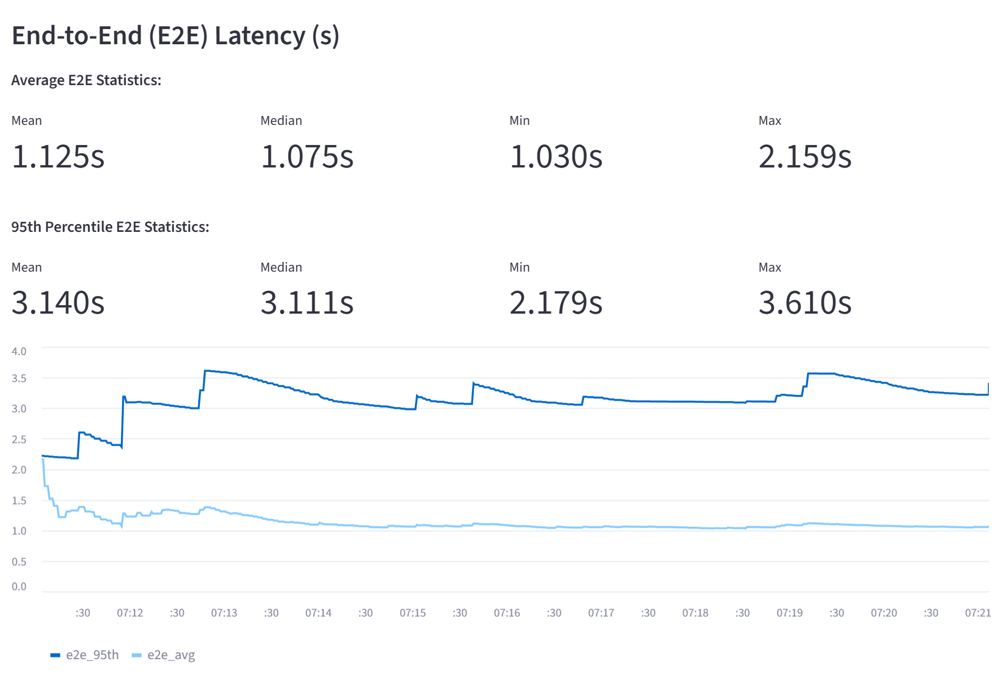
main: {x-ms-oai-ev3-predictor_search_length:2}
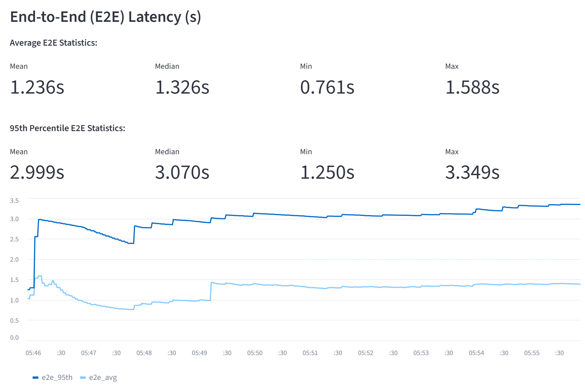
main: {x-ms-oai-ev3-predictor_search_length:4}
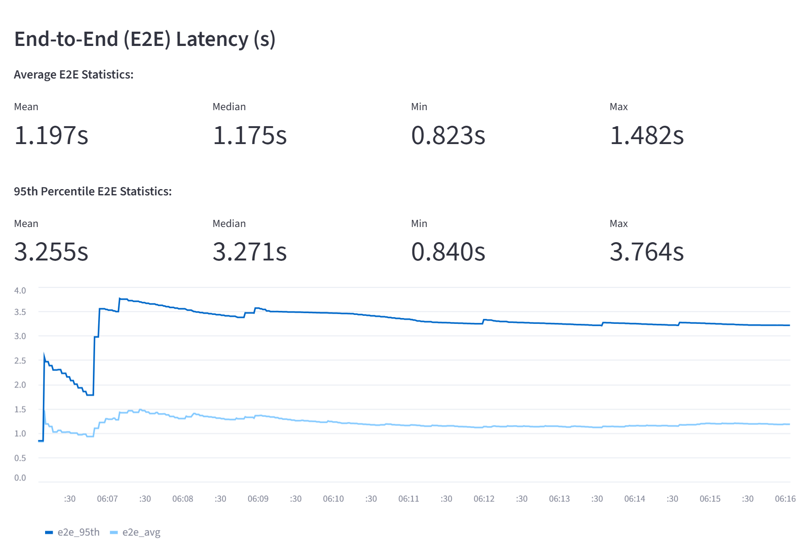
main: {x-ms-oai-ev3-predictor_search_length:8}
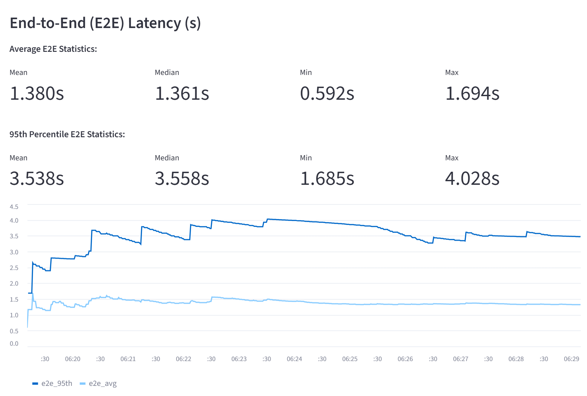
main: {x-ms-oai-ev3-predictor_search_length:16}
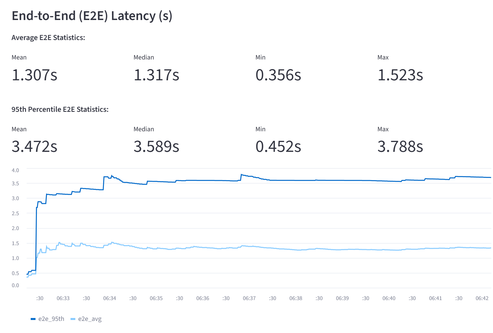
main: {x-ms-oai-ev3-predictor_search_length:32}
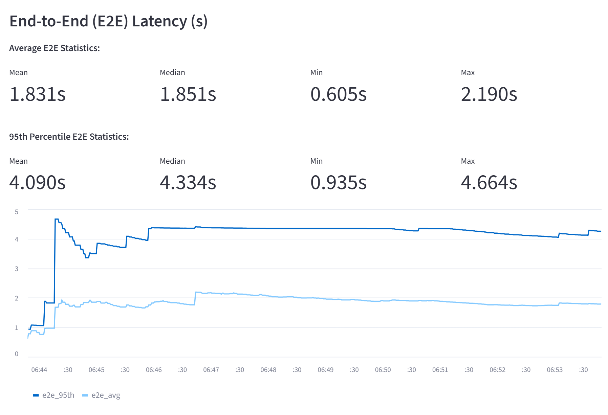

main: without x-ms-oai-ev3-predictor_search_length header parameter
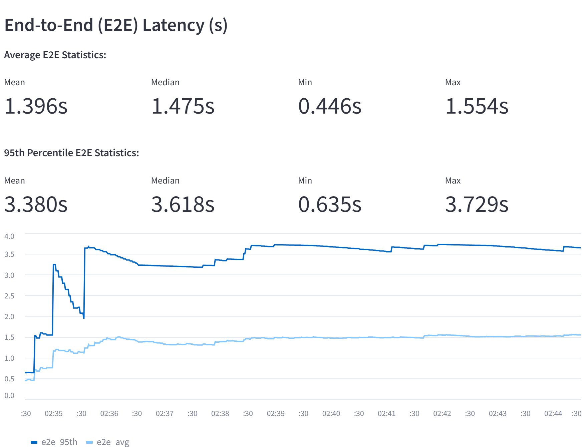

**Technical Details:**
- **Default Value**: 32 tokens
- **Purpose**: Controls the search window for token reconvergence in speculative decoding
- **Performance Impact**: Lower values (even as low as 1) can provide significant gains in decoding time per token
- **Trade-off**: Balance between search thoroughness and decoding speed

**Usage Guidelines:**
- Start with lower values (1-4) for maximum speed optimization
- Use higher values (16-32) when prediction accuracy is more important than speed
- Test different values to find the optimal balance for your specific use case

**How it Works:**
The parameter determines how many tokens the model examines when deciding whether to reconverge from generative mode back to speculation mode during the predicted-outputs process. A smaller search length means faster decisions but potentially less optimal reconvergence points.

### Example Usage
Below are examples of using predicted-outputs in Azure OpenAI with different predictor search length configurations:

```python
import openai

openai.api_key = "your_api_key"
openai.api_base = "your_api_base"

# Example 1: Maximum speed optimization (minimal search length)
response_fast = openai.ChatCompletion.create(
    engine="your_deployment_name",
    messages=[{"role": "user", "content": "Complete this code: def hello_world(): print("}],
    prediction="Hello, World!")",
    headers={
        "x-ms-oai-ev3-predictor_search_length": "1"  # Fastest decoding
    }
)

# Example 2: Balanced approach
response_balanced = openai.ChatCompletion.create(
    engine="your_deployment_name",
    messages=[{"role": "user", "content": "Complete this code: def hello_world(): print("}],
    prediction="Hello, World!")",
    headers={
        "x-ms-oai-ev3-predictor_search_length": "8"  # Balance between speed and accuracy
    }
)

# Example 3: Default behavior (can be omitted)
response_default = openai.ChatCompletion.create(
    engine="your_deployment_name",
    messages=[{"role": "user", "content": "Complete this code: def hello_world(): print("}],
    prediction="Hello, World!")",
    headers={
        "x-ms-oai-ev3-predictor_search_length": "32"  # Default value
    }
)
```

**Performance Comparison Table:**
| Search Length | Speed | Accuracy | Use Case |
|---------------|-------|----------|----------|
| 1 | Fastest | Good | Real-time applications, chat |
| 2-4 | Very Fast | Good | Interactive applications |
| 8-16 | Fast | Better | Balanced performance |
| 32 (default) | Standard | Best | High-accuracy requirements |
```
**Note**: Requires an Azure OpenAI API key and is subject to their terms of service.

### References
- [Azure OpenAI Documentation](https://learn.microsoft.com/en-us/azure/ai-foundry/openai/how-to/predicted-outputs?tabs=python-secure)
- [Medium Article: Speed Up OpenAI API Responses](https://cobusgreyling.medium.com/speed-up-openai-api-responses-with-predicted-outputs-3a2285fff261)

## 3. Prompt Caching vs. Predicted-Outputs: Key Differences

### Fundamental Approach Differences
| Aspect | Prompt Caching | Predicted-Outputs |
|--------|----------------|-------------------|
| **Optimization Target** | Repeated prompt segments | Anticipated output content |
| **Trigger Mechanism** | Automatic on prompt reuse | Manual prediction provision |
| **Computation Savings** | Input processing | Output generation |
| **Cost Impact** | Reduced input token costs | May incur costs for rejected predictions |

### When to Use Each Technique
- **Prompt Caching**: Best for repeated system prompts, conversational applications, and template-based generation
- **Predicted-Outputs**: Ideal for document revision, code completion, and scenarios where output content is predictable

### Why Use Both Together?
These techniques are complementary:
- Prompt caching optimizes input processing
- Predicted-outputs optimizes output generation  
- Combined use can achieve maximum latency reduction

## 4. Combining Prompt Caching and Predicted-Outputs

### Usage Example

```python
# Example: Conversational AI with both optimizations
response = openai.ChatCompletion.create(
    engine="gpt-4o",
    messages=[
        {"role": "system", "content": "You are a helpful customer service agent..."},  # Will be cached
        {"role": "user", "content": "I need help with my order"}
    ],
    prediction="I'd be happy to help you with your order. Could you please provide your order number?"
)
```

### Best Practices
- **Structure prompts** to maximize cache hits by placing stable content at the beginning
- **Use high-confidence predictions** to avoid unnecessary costs from rejected predictions
- **Monitor performance** to track cache hit rates and prediction acceptance rates

### Performance Expectations
- **Prompt Caching**: 20-50% latency reduction for repeated prompts
- **Predicted-Outputs**: 30-70% latency reduction for good predictions  
- **Combined Usage**: Up to 80% total latency reduction in optimal scenarios

## 5. Alternative Approaches: Speculative Decoding

### What is Speculative Decoding?
Speculative decoding is a technique to accelerate inference in autoregressive models (e.g., transformers) without altering output quality. Introduced in the paper "Fast Inference from Transformers via Speculative Decoding" ([arXiv:2211.17192](https://arxiv.org/abs/2211.17192)), it uses a smaller, faster assistant model to generate candidate tokens, which are verified by a larger main model in a single forward pass.

### Relationship to Predicted-Outputs
Speculative decoding shares conceptual similarities with predicted-outputs:
- Both techniques leverage "predictions" about likely output content
- Both aim to reduce the computational cost of generation
- However, speculative decoding uses a separate model for predictions, while predicted-outputs uses user-provided predictions

### Key Requirements
- **Assistant Model**: Must be at least 3x faster than the main model and predict 70–80% of "easy" tokens correctly.
- **Tokenizer Compatibility**: Both models must share the same vocabulary and tokenizer.
- **Performance**: Best at batch size 1, with diminishing returns above batch size 4.

## 6. Comprehensive Performance Optimization Strategy

### Multiple Optimization Techniques Comparison
| Feature | Prompt Caching | Predicted-Outputs | Speculative Decoding |
|---------|----------------|-------------------|---------------------|
| **Platform** | Cloud providers (Azure, OpenAI) | Azure OpenAI API | Open-source (e.g., Transformers) |
| **Target** | Input processing | Output generation | Output generation |
| **Automation** | Automatic | Manual prediction | Automatic |
| **Cost** | Reduced input costs | Output token billing | Free (local compute) |
| **Latency Reduction** | 20-50% | 30-70% | 2x-3x speedup |

### Decision Framework
- **Choose Prompt Caching**: For repeated prompts and cost optimization
- **Choose Predicted-Outputs**: When you can anticipate output content  
- **Choose Speculative Decoding**: For local deployments and open-source models
- **Combine Techniques**: When maximum performance justifies complexity

### Other Complementary Solutions
- **Knowledge Distillation**: Training smaller models to mimic larger ones for faster inference.
- **Model Pruning**: Reducing model size by removing less important weights.
- **Quantization**: Using lower precision (e.g., INT8) for faster computation.

## 7. Conclusion
This project highlights the evolution of LLM optimization techniques, from prompt caching to predicted-outputs and speculative decoding. These complementary approaches can be combined to achieve significant performance improvements:

- **Prompt Caching** provides transparent optimization for repeated input patterns
- **Predicted-Outputs** offers targeted acceleration when output content is predictable  
- **Speculative Decoding** enables open-source alternatives with consistent speedups

The combination of these techniques represents a comprehensive approach to LLM optimization, enabling developers to choose the right strategy based on their specific use cases, infrastructure, and performance requirements. Future work should explore automated prediction generation, hybrid caching strategies, and intelligent technique selection based on request patterns.

## References
- [Azure OpenAI Predicted-Outputs Documentation](https://learn.microsoft.com/en-us/azure/ai-foundry/openai/how-to/predicted-outputs?tabs=python-secure)
- [Azure OpenAI Prompt Caching Documentation](https://learn.microsoft.com/en-us/azure/ai-services/openai/how-to/prompt-caching)
- [Medium: Speed Up OpenAI API Responses](https://cobusgreyling.medium.com/speed-up-openai-api-responses-with-predicted-outputs-3a2285fff261)
- [Hugging Face: Whisper Speculative Decoding](https://huggingface.co/blog/whisper-speculative-decoding)
- [Hugging Face: Assisted Generation](https://huggingface.co/blog/assisted-generation)
- [ArXiv: Fast Inference from Transformers via Speculative Decoding](https://arxiv.org/abs/2211.17192)
- [Google Research: Speculative Decoding](https://research.google/blog/looking-back-at-speculative-decoding/)
